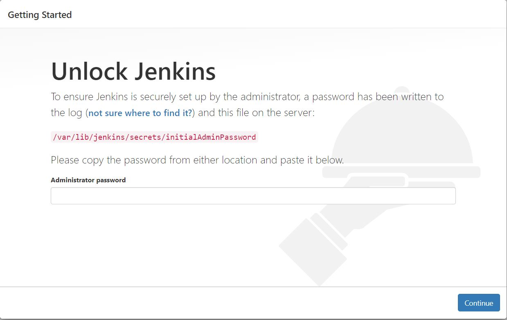
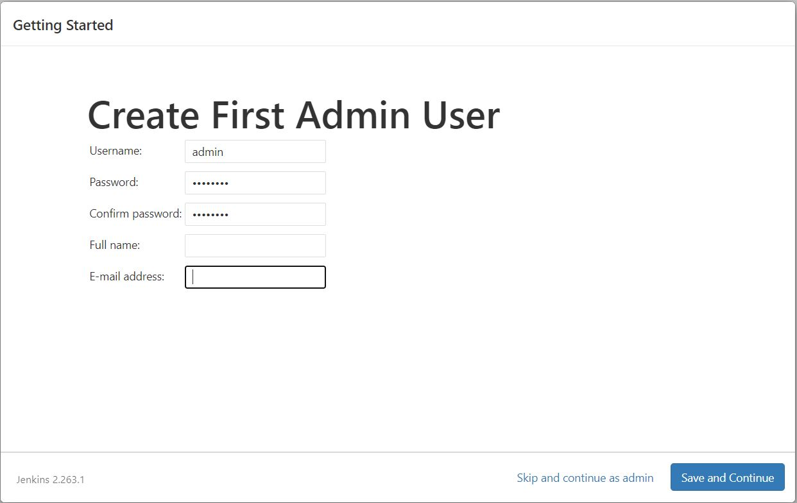

# Jenkins Installation Process

## Step-01: Provision a Virtual Machine (you may install jenkins on physical machine)

## Step-02: Install Java as a pre-requisite and setup system variables

```
# Install Java as a pre-requisites for jenkins installation
yum install -y java-17-amazon-corretto.x86_64

# To verify java installation
java --version

# To verify jenkins installation
jenkins --version

```

## Step-03: Download and Install `Jenkins` and `Git`

```
# Pull jenkins repos info required for its installation
wget -O /etc/yum.repos.d/jenkins.repo https://pkg.jenkins.io/redhat-stable/jenkins.repo

# Download the jenkins signing keys
rpm --import https://pkg.jenkins.io/redhat-stable/jenkins.io-2023.key
yum -y upgrade

# To install on EC2 Instance (Amazon Linux 2)
yum install -y jenkins

# Start the jenkins service
systemctl start jenkins

# Enable the jenkins service
systemctl enable jenkins

# Install Git
yum install -y git
```

## Step-04: Update Jenkins Server Security Group rules - Allow ingress traffic on 8080

- Navigate to your Jenkins server (EC2 Instance) >> **Security** tab
- Click on your security group name >> Select **Inbound Rules** >> _Edit Inbound Rules_
- Click _Add Rule_ button
  - **Type**: Custom TCP
  - **Source**: Anywhere IPv4

## Step-05: Access Jenkins server's dashboard (Sign-in page)

- Open browser on your local system and navigate to http://<your_jenkinsserver_public_ip>:8080
- You will be able to access Jenkins through its management interface:
  

## Step-06: Configuring Jenkins - Authenticate for first time use

- As prompted, enter the password found in your Jenkins server's this file **/var/lib/jenkins/secrets/initialAdminPassword**

```
sudo cat /var/lib/jenkins/secrets/initialAdminPassword
# Copy the password and paste it in the Jenkins management interface password field

```

- The Jenkins installation script directs you to the Customize Jenkins page.
- Click **Install suggested plugins**.

## Step-05: Setup and Install Jenkins plugins

- Once the plugins installation is complete, the Create First Admin User will open. Enter your information, and then select **Save and Continue**.

## Step-06: Create the first admin user

- Once the plugin installation is complete, the Create First Admin User will open.
- Enter your information, and then select **Save** and **Continue**.



- Now, you should be able to land on Jenkins Dashboard after successfully log in with your jenkins admin user.
