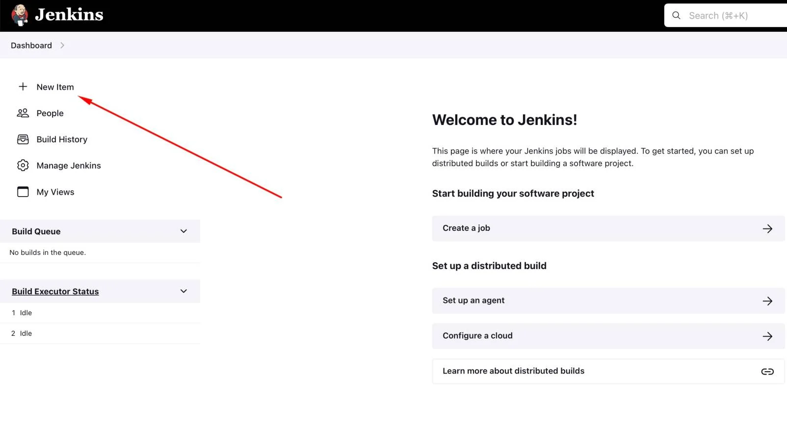
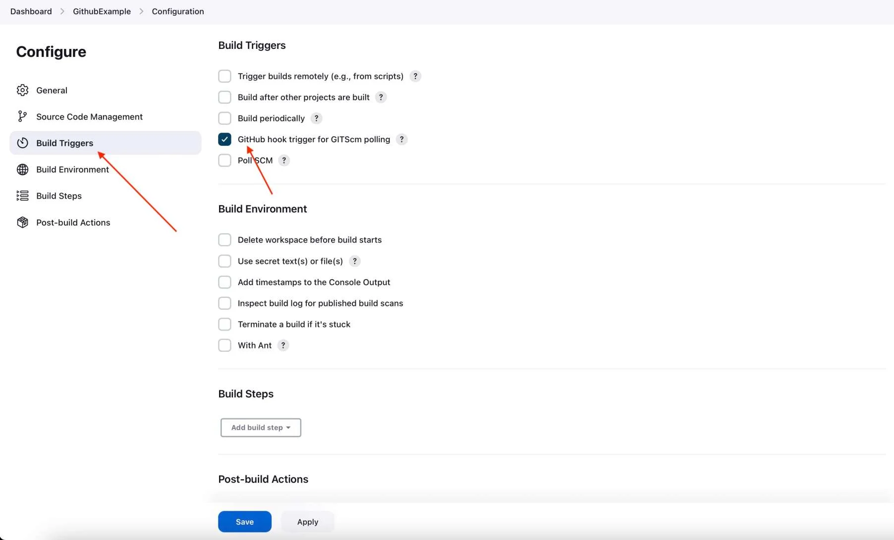

# Continous Integration with Jenkins

## Different ways of Integrating Jenkins with Github repos (remote)

### 1. Using `Poll SCM`

- Jenkins will keep polling to your github repos to check if there is any new check-ins.

### 2. Using `Github Webhooks`

- Jenkins will listen to a webhook and GitHub will let jenkins know if there are any new check-ins.

## Lab-01: Integrate your Github with Jenkins server using `Webhooks`

### Step-01: Create a new Github repository

### Step-02: Create a Github Webhook for the Jenkins Server

- On GitHub.com, navigate to the main page of the repository.
- Under your repository name, click **Settings**. If you cannot see the "**Settings**" tab, select the dropdown menu, then click **Settings**.
- In the left sidebar, click **Webhooks** >> **Add webhook**
  - **Payload URL**: Jenkins environment URL and at the end of this URL add /github-webhook/.
  ```
  Ex Payload URL: http://10.20.153.120:8080/github-webhook/
  ```
  - **Content type**: application/json
  - **Secret**: Leave the field empty
  - **Which events would you like to trigger this webhook?**: Let me select individual events >> check **Pull Requests** and **Pushes**
  - **Active**: Yes
- Click on **Add Webhook** button

### Step-03: Configure Jenkins for pulling the code from Github using Webhooks

- In Jenkins dashboard, click on **New Item** to create a new project.
  
- Give your project a **Name**, then choose **Freestyle project** and click on **OK**.
- Click on the **Source Code Management** tab.
- Click on **Git** and paste your GitHub repository URL in the **Repository URL** field.
- Click on the **Build Triggers** tab and then on the **GitHub hook trigger for GITScm polling**.
  

- Click on the **Build** tab, then click on **Add build step** and choose **Execute shell**.

```
echo "This jenkins build job is triggered by github webhook"

```

- Click **Apply** and then **Save**.
- Your GitHub repository is now integrated with your Jenkins project. With this Jenkins GitHub integration, you can now use any file present in your GitHub repository and trigger the Jenkins job to run with every code commit.

### Step-04: Trigger the Jenkins build job with Github code checkin

- Navigate to your github repos and make some changes in any of the file.
- Commit the changes.
- Now navigate back to your Jenkins project and you'll see that a new job was triggered automatically from the commit we made at the previous step.
- Click on the little arrow next to the job and choose **Console Output**.
- You will be able to see that Jenkins was able to pull code from your github repo and display above echo message.
