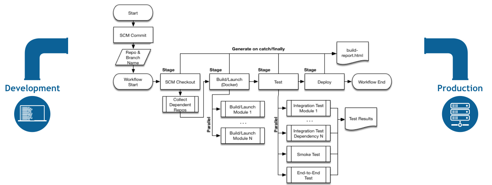

# Understanding Jenkins Pipelines and Jenkinsfile

## Getting started with Pipelines

- **Pipelines** are sets of processes that are used to compile, build, and deploy code into a production environment. With Pipelines you can:
  - Manage automated builds, tests, and deployments as one workflow.
  - Deliver quality products frequently and consistently from testing through staging to production automatically.
  - Automatically promote or prevent build artifacts from being deployed. If errors are discovered anytime during the process the Pipeline stops and alerts are sent to the appropriate team for their attention.

## What is Jenkins Pipeline?

- Jenkins Pipeline (or simply "Pipeline" with a capital "P") is a suite of plugins which supports implementing and integrating continuous delivery pipelines into Jenkins.
- A continuous delivery (CD) pipeline is an automated expression of your process for getting software from version control right through to your users and customers.
- This process involves building the software in a reliable and repeatable manner, as well as progressing the built software (called a "build") through multiple stages of testing and deployment.
- Pipeline provides an extensible set of tools for modeling simple-to-complex delivery pipelines "as code" via the Pipeline domain-specific language (DSL) syntax.
- The definition of a Jenkins Pipeline is written into a text file (called a **Jenkinsfile**) which in turn can be committed to a project’s source control repository.
- This is the foundation of "_Pipeline-as-code_"; treating the CD pipeline as a part of the application to be versioned and reviewed like any other code.

## Benefits of Jenkinsfile and committing to SCM

- Automatically creates a Pipeline build process for all branches and pull requests.
- Code review or iteration on the Pipeline (along with the remaining source code).
- Audit trail for the Pipeline.
- Single source of truth for the Pipeline, which can be viewed and edited by multiple members of the project.

## Why Pipeline?

## Continuous Delivery with Jenkins

## Jenkins Pipeline - `Key Concepts`

- **Pipeline**

  - A Pipeline is a user-defined model of a CD pipeline. A Pipeline’s code defines your entire build process, which typically includes stages for building an application, testing it and then delivering it.
  - Also, a pipeline block is a key part of Declarative Pipeline syntax.

- **Node**

  - A node is a machine which is part of the Jenkins environment and is capable of executing a Pipeline.
  - Also, a node block is a key part of Scripted Pipeline syntax.

- **Stage**

  - A stage block defines a conceptually distinct subset of tasks performed through the entire Pipeline (e.g. "Build", "Test" and "Deploy" stages), which is used by many plugins to visualize or present Jenkins Pipeline status/progress.
