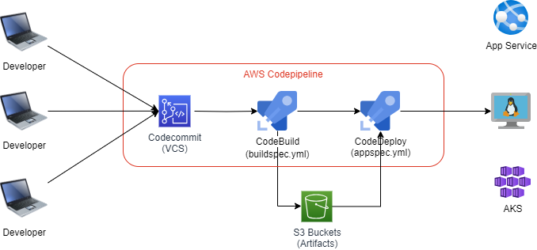

# Continuous Integration with `AWS CodeBuild`

## Introduction

- `CodeBuild` is a fully managed build service in the cloud.
- Compiles your source code, runs unit tests, and produces artifacts that are ready to deploy
- Eliminates the need to provision, manage, and scale your own build servers.
- It provides prepackaged build environments for the most popular programming languages and build tools such as Apache Maven, Gradle, and more.
- We can also customize build environments in CodeBuild to use ourown build tools.
- Scales automatically to meet peak build requests.

## How CodeBuild works?

### Step-01: Check-in the Application code in AWS CodeCommit repository

- Develop the `application code` on your local system, compile it and commit the changes.
- Check-in (push) the code into AWS CodeCommit repos.

### Step-02: Create a S3 bucket for storing build artifacts

- Create a S3 bucket and a folder inside it for storing the build artifacts.

### Step-03: Create CodeBuild Project

- Create CodeBuild project in the same region as your build artifact's S3 bucket.
- Start build, verify build logs, verify build phase details.

### Step-04: Create a buildspec.yml and trigger build

- Create buildspec.yml and check-in code into CodeCommit repository
- Start build, verify build logs, verify build phase details
- Download the artifacts from S3, unzip and review
- Run one more build and see versioning in S3.

### Step-05: Create Build Notifications
